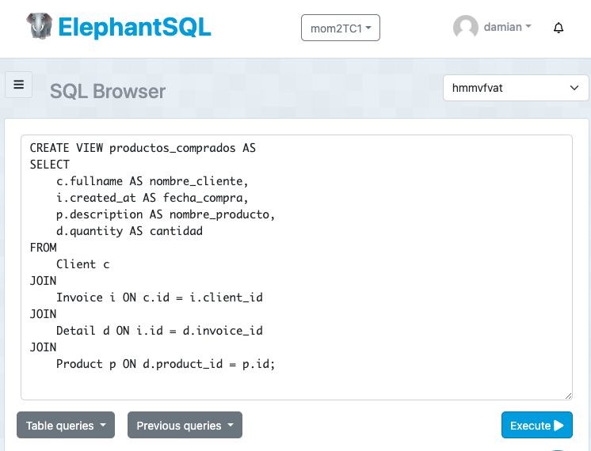
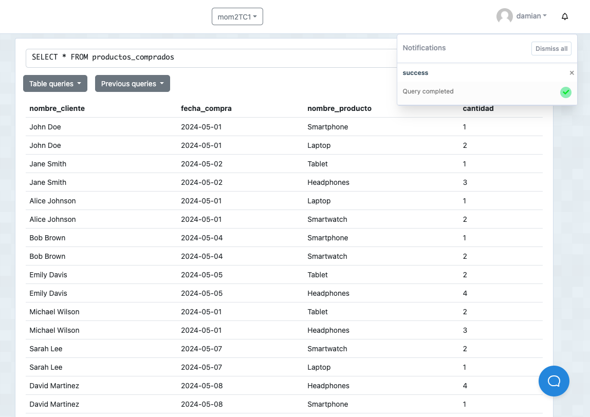
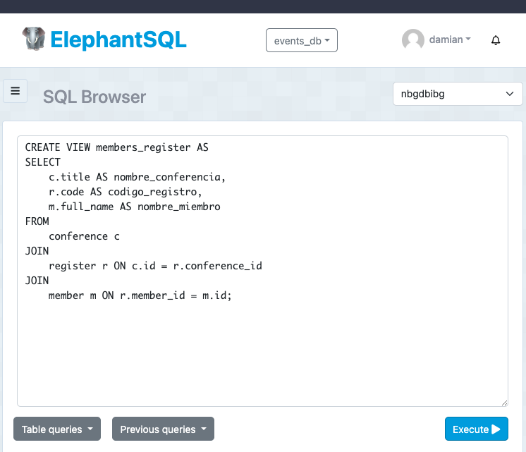

# Tarea12 - views

Damian Olivo

## 1. Crear una vista que muestre la lista de productos comprados por los clientes con las siguientes columnas: 

Base de datos: invoice
nombre_cliente | fecha_compra | nombre_producto | cantidad

  - Sentencia:

```
  CREATE VIEW productos_comprados AS
SELECT 
    c.fullname AS nombre_cliente,
    i.created_at AS fecha_compra,
    p.description AS nombre_producto,
    d.quantity AS cantidad
FROM 
    Client c
JOIN 
    Invoice i ON c.id = i.client_id
JOIN 
    Detail d ON i.id = d.invoice_id
JOIN 
    Product p ON d.product_id = p.id;
```
  - Captura:




## 2. Crear una vista donde se muestre la lista de miembros registrados a las conferencias.
Base de datos: event
nombre_conferencia | codigo_registro | nombre_miembro 

  - Sentencia:

```
CREATE VIEW members_register AS
SELECT 
    c.title AS nombre_conferencia,
    r.code AS codigo_registro,
    m.full_name AS nombre_miembro
FROM 
    conference c
JOIN 
    register r ON c.id = r.conference_id
JOIN 
    member m ON r.member_id = m.id;

```
  - Captura:


